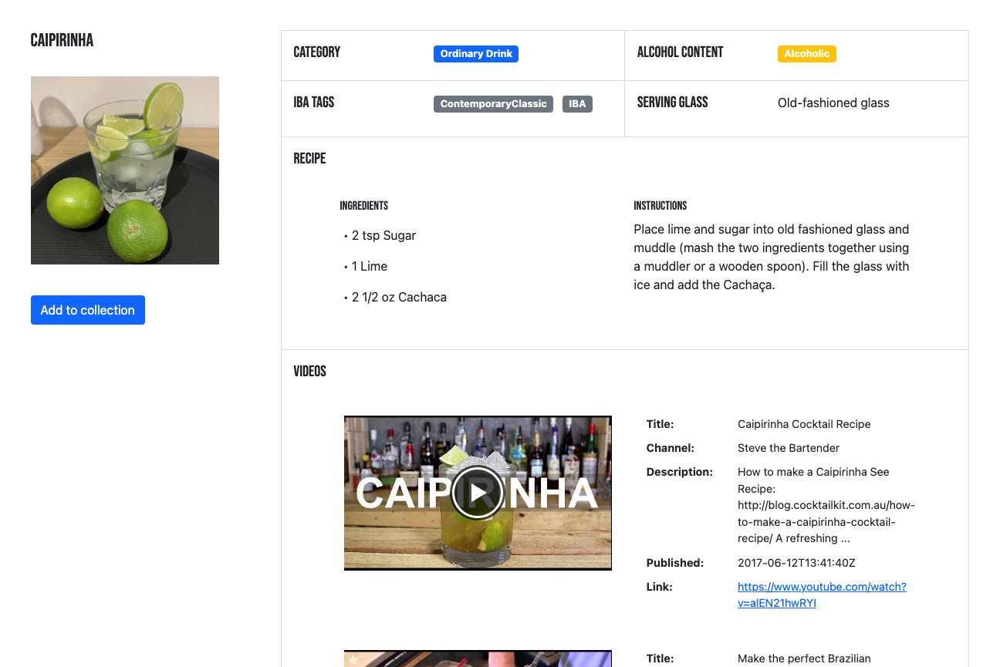

# Mixology App



## Description

**Mixology App** helps you easily curate your favorite drinks, research new recipes, compose tasting notes, submit ratings and more. It is a demo app that I built to explore the integration of multiple third party APIs with a MongoDB database, as well as applying static typing via TypeScript. The app is relatively small in scope, but it has architectural elements in place (e.g. JSON Web Token, Mongoose, React-Router, Redux Toolkit) to help developers scale up its functionality easily. Feel free to fork or extend the codebase for your own project!

Mixology App is an example of a "MERN stack" application which consists of the following technologies:

- **MongoDB**: A document-based open source database.
- **Express**: A web application framework for Node.js.
- **React**: A JavaScript front-end library for building user interfaces.
- **Node.js**: JavaScript run-time environment that executes JavaScript code outside of a browser (such as a server).

This stack makes it possible to quickly build and easily maintain a full-stack web app. While MERN is a solid foundation for building a web app, I did run into some bumps in the road while integrating third party API data (provided by [TheCocktailDB API](https://www.thecocktaildb.com/api.php) and the [Youtube Data API](https://developers.google.com/youtube/v3)) with the Node.js backend. This was not too surprising since no two APIs are designed exactly alike, but the experience was a good reminder to refrain from making any assumptions about third party APIs regarding their design, functionality, data interface, reliability, etc.

## File structure

- `src`
  - `api` - This folder holds files used by the API client
  - `assets` - This folder holds assets such as images
  - `components` - This folder holds different components that will make up our views
  - `config` - This folder holds app configuration files
  - `controllers` - This folder holds controller functions used by Express.js
  - `db` - This folder holds database models and connection files
  - `hooks` - This folder holds React hooks for use in functional components
  - `layout` - This folder holds components used for page layout
  - `middleware` - This folder holds middleware used by Express.js
  - `pages` - This folder holds components organized by page level view
  - `routers` - This folder holds routers used by Express.js
  - `store` - This folder holds files used to connect to the Redux store and call actions
  - `styles` - This folder holds stylesheets used by the frontend
  - `utils` - This folder holds utility functions
  - `App.tsx` - Renders all of our browser routes and different views
  - `custom.d.ts` - Custom type declarations for third party packages
  - `index.html` - Our index.html file
  - `index.tsx` - Entrypoint for React app
  - `server.ts` - Entrypoint for Node.js app
  - `types.ts` - Custom type declarations
  - `validation.ts` - Used for form validation
- `package.json` - Defines npm behaviors and packages
- `package-lock.json` - Tracks dependency tree
- `.babelrc` - Configuration file for Babel.js
- `.env.sample` - Sample file containing environment variables used by dotenv.js
- `.gitignore` - Directories to exclude from git tracking
- `.prettierrc.cjs` - Configuration file for Prettier.js
- `.seedDrinks.js` - Script for seeding drink documents in MongoDB
- `.seedDrinkVideos.js` - Script for seeding drink documents' video data in MongoDB
- `.tsconfig.json` - Configuration file for TypeScript
- `.webpack.common.js` - Webpack configuration file for common settings
- `.webpack.development.js` - Webpack configuration file for development mode settings
- `.webpack.production.js` - Webpack configuration file for production mode settings
- `README.md` - This file!

## Initial Setup

Mixology App was built using Node version 16. Please install a long-term support (LTS) version for best compatibility with other libraries.

- Node.js <https://nodejs.org/en/download/>

To verify that you have Node.js installed on your system, type the following command in your command line terminal (Terminal for Mac/Linux, CMD for Windows).

```console
node -v
```

### Environment Variables

Before you build or run the app, create two new files called `.env.development` and `.env.production` at the project root. These are configuration files that will be used by dotenv.js to expose environment variables to your app at runtime.

In each file, you need to enter values for the following environment variables (refer to `.env.sample` for examples):

`PORT`: Port where the app will run

`MONGO_HOST`: Name of the Mongo host (e.g. `localhost` in development mode)

`MONGO_PORT`: Mongo port (e.g. `27017`)

`MONGO_DB`: Name of the Mongo database used

`MONGO_PASS`: Mongo password (optional)

`API_URL`: Base URL for API calls to the Node app (e.g. `http://localhost:3000/api` in development mode)

`THECOCKTAILDB_API_URL`: Base URL for The CocktailDB API

`YOUTUBE_API_URL`: Base URL for Youtube Data API

`YOUTUBE_API_KEY`: Key used for Youtube Data API calls. You need to create a free Google Developers account in order to generate this key.

`JWT_SECRET_KEY`: Private key used by JSON Web Token (JWT)

`JWT_EXPIRATION`: JWT token expiration (in seconds)

`JWT_REFRESH_EXPIRATION`: JWT refresh token expiration (in seconds)

### MongoDB

Mixology App is designed to work best with a local installation of MongoDB (v4.4.6), but can be used with MongoDB instances located elsewhere.

First set up your local installation of Mongo using instructions corresponding to your operating system.

- MongoDB <https://www.mongodb.com/try/download>

Once those steps have been completed, you need to create a new Mongo database to store your app data. This can be done in several ways, but most commonly with the Mongo shell CLI which comes pre-installed with MongoDB. You can run Mongo shell from your command line using the `mongo` command. Once you are in the shell, create a new Mongo database (e.g. `mixologyapp_db`). Then create a new collection called `drinks` within the database. This is the collection that will be used to store drink documents for your app.

NOTE: The name of the Mongo database should also be used as the value for the `MONGO_DB` environment variable (see *Environment Variables* above).

Next you need to seed your database with app data using the seeding scripts `seedDrinks.js` and `seedDrinkVideos.js`. These scripts assume that you are running a local instance of MongoDB and your environment variables are properly configured in `.env.development`. Make sure to run the following scripts in order (First `seedDrinks.js` then `seedDrinkVideos.js`).

Seed drink documents by running `node seedDrinks.js`

- This script connects to your Mongo database, makes network calls to The CocktailDB API for drink data, and updates the `drinks` collection in the database with new drink documents. If the script runs successfully, you should see a success message in the terminal (`Database seeded!`) and the new documents should be visible in your database.

Seed drink documents' video data by running `node seedDrinkVideos.js`

- This script connects to your Mongo instance, makes network calls to the Youtube Data API for video data corresponding to each document in your `drinks` collection, and updates those documents with the returned video data. If the script runs successfully, you should see a success message in the terminal (`Drink videos updated successfully!`) and the updated documents should be visible in your database.
- Depending on your access policy, the Youtube Data API may limit the quantity and frequency of calls it will accept from a given client. You may set or remove this limit manually using the line `.limit(20)` inside the `seedVideos` funtion. Depending on the result, you may need to run `seedDrinkVideos.js` multiple times in order to seed every drink document in your database.

## Run the app

Once you've verified Node and MongoDB has been installed and your database has been properly seeded, install Mixology App dependencies using `npm install`.

To run the app in development mode, run the command `npm run dev`. This triggers a workflow which lints the source code, checks for correct typing via the TyepScript compiler, bundles the frontend code using Webpack and serves up the Node app in your local environment via Webpack Dev Server. Once the workflow is complete, you should be able to see the server running in the terminal. If it started correctly, the following message will appear in the terminal, `Server started at http://localhost:3000`. Then try visiting `http://localhost:8080` in your browser to verify that you can access the frontend.

To run the app in production mode, first run the command `npm run build`.

NOTE: Make sure you've created a `.env.production` file with the required environment variables before running this command!

This will bundle the source code and static assets using Webpack and emit them into the `dist` folder. Once you've verified the bundled files have been created, run `npm run pm2` to start the app as a background process using the process management tool PM2. You can use any process manager of your choice, but PM2 generally works well with Node apps.

## Authentication

Mixology App uses JSON Web Token (JWT) for authentication. JWT is a popular choice for authentication in Node.js apps for several reasons:

- Fewer database queries
- Less development time
- Easier to scale up with userbase
- Better portability across services

Since the backend of our app acts as both issuer and verifier of JWT tokens, it only needs one private key for authentication purposes. This is the key designated in your `.env` files as the `JWT_SECRET_KEY` environment variable.

NOTE: It is IMPORTANT to never share sensitive information such as keys or passwords! Make sure to apply appropriate security settings to prevent exposing your files.

### Authorization

Each user document in the database includes a `roles` field which can take on one of three values: `user`, `moderator` or `admin`. These values aren't currently used for authorization purposes, but can be used to build out an authorization layer on top of the authentication workflow if desired.

## React & Redux

The frontend is a single-page React app that supports client-side routing via React-Router. This enables fast navigation between views and reduces the amount of network calls initiated by the frontend.

NOTE: To support single-page apps in production, you will need to update the configuration of the web server used to serve your app externally (e.g Nginx).

Client data is stored using Redux which promotes data consistency, reduces database calls, and allows the use of Redux Devtools for development.

All updates to Redux data are also persisted to localStorage (in the object located at `localStorage.state`) for access between browser sessions. If at any point the app displays data which appears out of sync, try clearing out your browser's localStorage and reloading the browser window.
